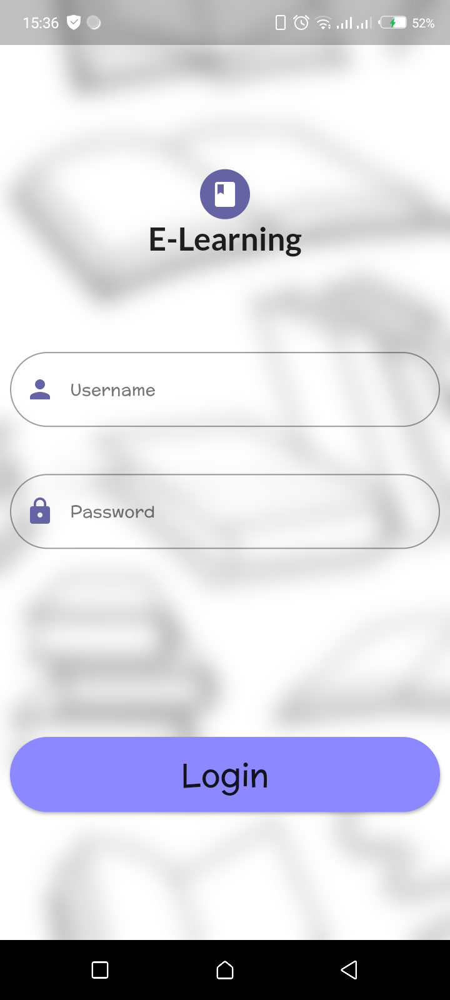
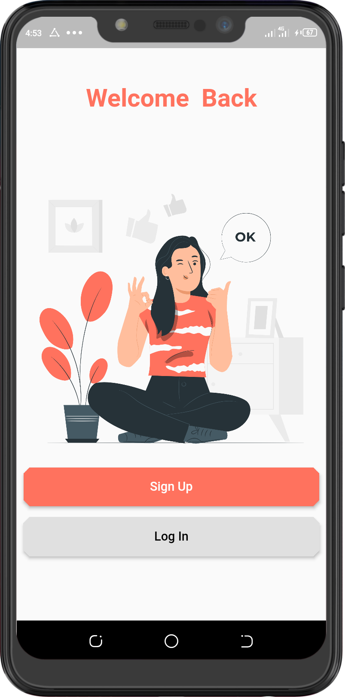
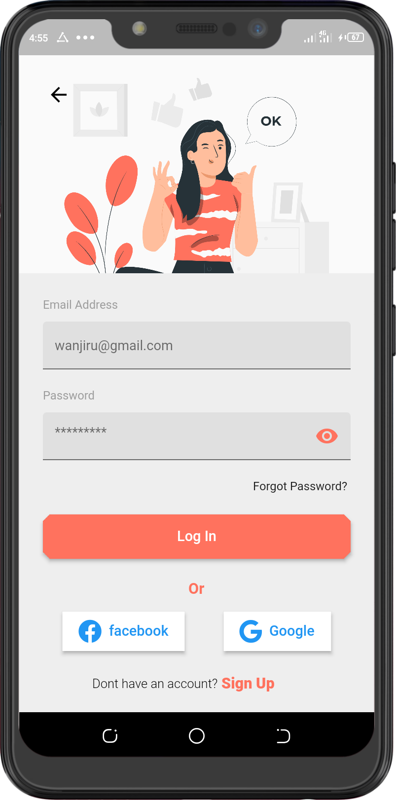
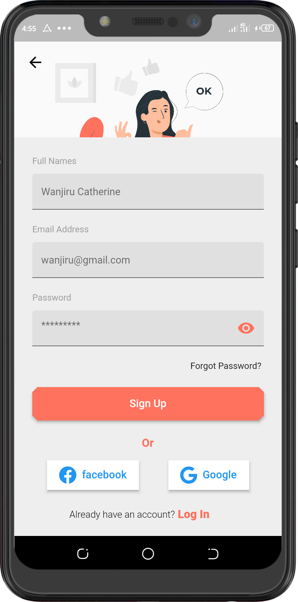
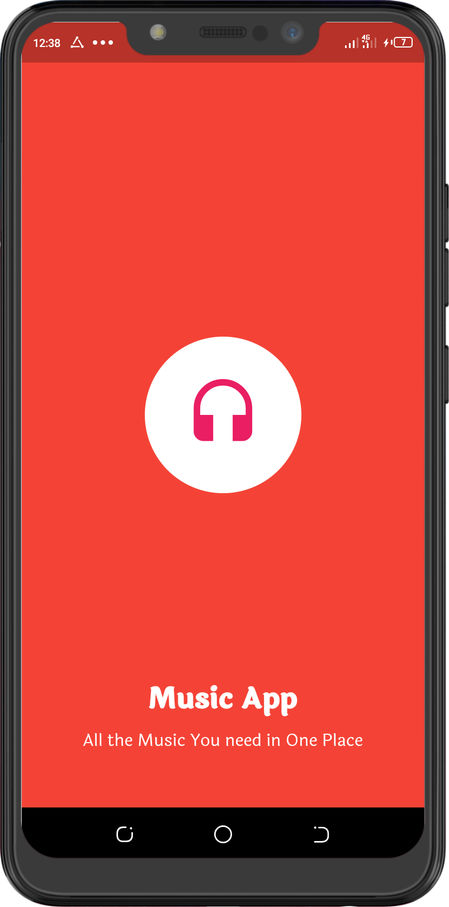
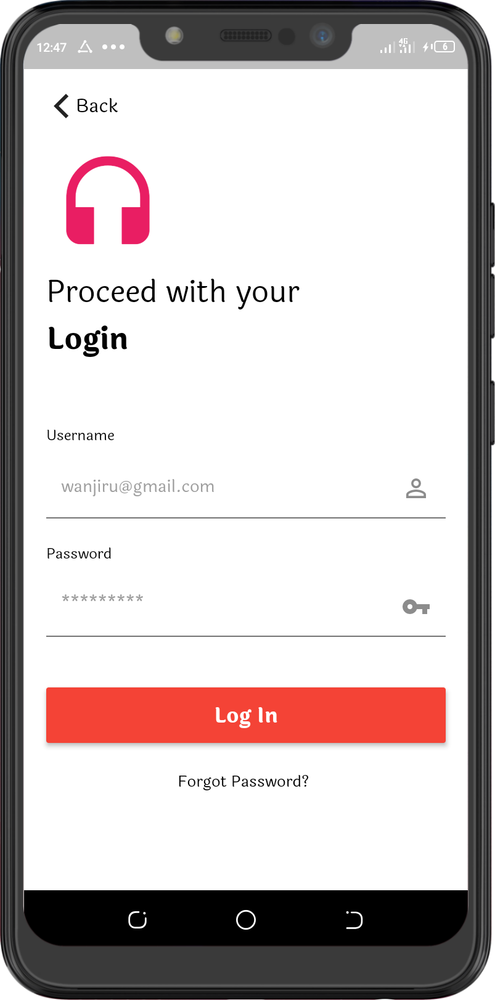

# Login UI

Login UI designs Inspiration from pinterest and Dribble

## Login 1 UI

<table>
<tr>
<td style="text-align: center">
    
</td>
</tr>
</table>

## Auth 2 UI

<table>
<tr>
<td style="text-align: center">

</td>
<td style="text-align: center">
    
</td>
  <td style="text-align: center">

</td>
</tr>
</table>

## Auth 3 UI

<table>
<tr>
<td style="text-align: center">
    
</td>
  <td style="text-align: center">

</td>
</tr>
</table>

